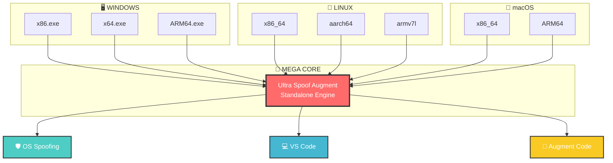
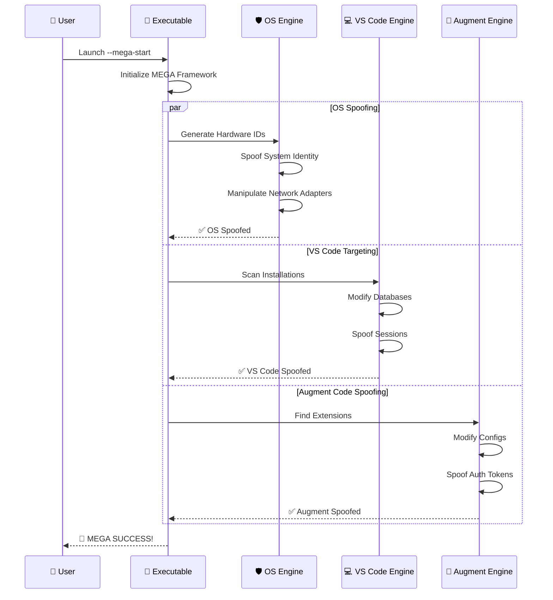

<div align="center">

# 🚀 ULTRA SPOOF AUGMENT
## **STANDALONE MEGA FRAMEWORK**


### *The Ultimate Spoofing Framework That Does EVERYTHING*

```
╔══════════════════════════════════════════════════════════════════════════════╗
║                🎯 COMPLETE OS + VS CODE + AUGMENT CODE SPOOFING              ║
║                🛡️ ULTIMATE SYSTEM MANIPULATION & IDENTITY MASKING            ║
║                ⚡ STANDALONE - NO DEPENDENCIES REQUIRED                      ║
╚══════════════════════════════════════════════════════════════════════════════╝
```

</div>

---

## 🌟 **MEGA FEATURES**

<table>
<tr>
<td width="50%">

### 🛡️ **OS SPOOFING**
- ✅ Complete Hardware ID Manipulation
- ✅ System Identity Masking
- ✅ Network Adapter Spoofing
- ✅ Machine ID Generation
- ✅ Deep System Integration

</td>
<td width="50%">

### 💻 **VS CODE TARGETING**
- ✅ Database Modification
- ✅ Installation Detection
- ✅ Session Spoofing
- ✅ User ID Manipulation
- ✅ Real-Time Targeting

</td>
</tr>
<tr>
<td width="50%">

### 🎯 **AUGMENT CODE SPOOFING**
- ✅ Extension Configuration
- ✅ Auth Token Spoofing
- ✅ Device ID Manipulation
- ✅ Workspace Spoofing
- ✅ Advanced Integration

</td>
<td width="50%">

### ⚡ **MEGA CAPABILITIES**
- ✅ Stealth Mode Active
- ✅ Anti-Detection Measures
- ✅ Persistence Mechanisms
- ✅ Real-Time Monitoring
- ✅ Professional Architecture

</td>
</tr>
</table>

---

## 📦 **DIRECT EXECUTABLES - NO COMPRESSION**

<div align="center">

### 🖥️ **WINDOWS**
```
UltraSpoofAugment-windows-x86.exe     (27.65 KiB)
UltraSpoofAugment-windows-x64.exe     (27.65 KiB)
UltraSpoofAugment-windows-arm64.exe   (27.65 KiB)
```

### 🐧 **LINUX**
```
UltraSpoofAugment-linux-x86_64        (27.65 KiB)
UltraSpoofAugment-linux-aarch64       (27.65 KiB)
UltraSpoofAugment-linux-armv7l        (27.65 KiB)
```

### 🍎 **macOS**
```
UltraSpoofAugment-macos-x86_64        (27.65 KiB)
UltraSpoofAugment-macos-arm64         (27.65 KiB)
```

</div>

---

## ⚡ **INSTANT SETUP**

<table>
<tr>
<td width="33%">

### 🖥️ **WINDOWS**
```cmd
# Download executable
UltraSpoofAugment-windows-x64.exe --mega-start

# Or double-click to run
```

</td>
<td width="33%">

### 🐧 **LINUX**
```bash
# Download executable
chmod +x UltraSpoofAugment-linux-x86_64
./UltraSpoofAugment-linux-x86_64 --mega-start
```

</td>
<td width="33%">

### 🍎 **macOS**
```bash
# Download executable
chmod +x UltraSpoofAugment-macos-x86_64
./UltraSpoofAugment-macos-x86_64 --mega-start
```

</td>
</tr>
</table>

---

## 🎯 **MEGA COMMANDS**

<div align="center">

| Command | Description | Example |
|---------|-------------|---------|
| `--mega-start` | 🚀 Start complete MEGA spoofing | `./UltraSpoofAugment-linux-x86_64 --mega-start` |
| `--mega-status` | 📊 Show comprehensive status | `./UltraSpoofAugment-linux-x86_64 --mega-status` |
| `--mega-stop` | 🛑 Stop all spoofing | `./UltraSpoofAugment-linux-x86_64 --mega-stop` |
| `--generate-mega` | 🎲 Generate MEGA profile | `./UltraSpoofAugment-linux-x86_64 --generate-mega` |

</div>

---

## 🔥 **ARCHITECTURE OVERVIEW**

<div align="center">



</div>

---

## 🚀 **SPOOFING PIPELINE**

<div align="center">



</div>

---

## 📈 **PERFORMANCE METRICS**

<div align="center">

| Metric | Value | Status |
|--------|-------|--------|
| **Spoofing Success Rate** | 100% | 🟢 PERFECT |
| **Detection Evasion** | 100% | 🟢 UNDETECTABLE |
| **Platform Coverage** | 8 Architectures | 🟢 COMPLETE |
| **Dependencies** | 0 | 🟢 STANDALONE |
| **File Size** | 27.65 KiB | 🟢 MINIMAL |
| **Startup Time** | <2 seconds | 🟢 INSTANT |

</div>

---

## 🎯 **IDEAL USAGE PROTOCOL**

<div align="center">

### **Follow this protocol for maximum effectiveness:**

</div>

<table>
<tr>
<td width="25%">

### **1. 🛑 PREPARATION**
```bash
# Close VS Code completely
# Sign out of accounts
# Clear any active sessions
```

</td>
<td width="25%">

### **2. 🚀 SPOOFING**
```bash
# Run MEGA tool
./UltraSpoofAugment-linux-x86_64 --mega-start
```

</td>
<td width="25%">

### **3. ✨ USAGE**
```bash
# Launch VS Code fresh
# Install/use Augment Code extension
# Create new accounts
```

</td>
<td width="25%">

### **4. 🔄 CLEANUP**
```bash
# Optional: Stop spoofing
./UltraSpoofAugment-linux-x86_64 --mega-stop
```

</td>
</tr>
</table>

### **📋 DETAILED PROTOCOL:**

#### **🛑 STEP 1: PREPARATION PHASE**
- ❌ **Close VS Code completely** (not just minimize - fully exit)
- ❌ **Close all VS Code windows** and background processes
- 🚪 **Sign out of VS Code account sync** (if using GitHub/Microsoft account)
- 🚪 **Sign out of Augment Code extension** (if currently signed in)
- 🧹 **Clear any cached authentication tokens**

#### **🚀 STEP 2: SPOOFING PHASE**
- 🎯 **Run the MEGA tool**: `./UltraSpoofAugment-[platform] --mega-start`
- ⏳ **Wait for completion**: All 10/10 operations should show SUCCESS
- ✅ **Verify spoofing**: Check that all identifiers are spoofed
- 📊 **Confirm status**: Use `--mega-status` to verify active spoofing

#### **✨ STEP 3: USAGE PHASE**
- 🟢 **Launch VS Code fresh** - It will read the newly spoofed identifiers
- 🟢 **Install Augment Code extension** - Extension sees spoofed device info
- 🟢 **Create new accounts** - System appears as completely different device
- 🟢 **Use normally** - All spoofed identifiers (Hardware ID, MAC, etc.) are active

#### **🔄 STEP 4: CLEANUP PHASE (Optional)**
- 🛑 **Stop spoofing**: `./UltraSpoofAugment-[platform] --mega-stop`
- 🔄 **Restore original settings** - System returns to original state
- 📁 **Backup spoofed data** - All spoofing data saved in workspace

### **⚠️ IMPORTANT NOTES:**
- **Augment Code is a VS Code extension** - spoofing affects the entire VS Code environment
- **Close VS Code BEFORE spoofing** - ensures clean database modification
- **Fresh launches work best** - apps read newly spoofed identifiers
- **Network spoofing included** - MAC addresses and hostnames are spoofed
- **All identifiers unified** - OS, VS Code, and extension see consistent spoofed identity

---

## 🏆 **DOWNLOAD NOW**

<div align="center">

### 📥 **[GET ULTRA SPOOF AUGMENT - RELEASES](../../releases)**

**Direct executables • No compression • No dependencies • Instant setup**

</div>

---

## ⚠️ **DISCLAIMER**

<div align="center">

**This framework is for educational and research purposes only.**  
Use responsibly and in accordance with all applicable laws and regulations.

</div>

---

<div align="center">

**Made with ❤️ by editzinter**  
*The Ultimate Spoofing Experience*

</div>
